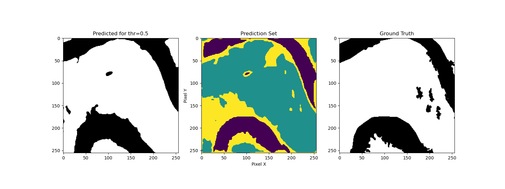

# Uncertainty-Aware Flood Segmentation with Conformal Prediction

> Official implementation of our IGARSS 2025 paper:  
> **Uncertainty-Aware Flood Segmentation from Sentinel-2 Observations with Conformal Prediction**  
> *Ioannis Konidakis, Klea Panayidou, Grigorios Tsagkatakis, Panagiotis Tsakalides*  
> [[PDF](./2025-IGARSS-UQ_CP.pdf)]

---

## Overview

This repository provides a framework for **uncertainty-aware flood segmentation** from **Sentinel-2 RGB imagery** using **Conformal Prediction (CP)**.

We apply both:
- **Inductive CP (ICP)**  
- **K-Fold CV+ CP**

...on top of the **OmbriaNet** bitemporal U-Net architecture.
<p align="center">
  
  
</p>

---

## Highlights

- Sentinel-2 (RGB) bitemporal input  
- Pixel-wise uncertainty via CP  
- CP Uncertainty Quantification vs Naive 
- Inductive CP vs K-Fold CV+ CP
- Evaluation: coverage, inefficiency, accuracy

---

## Dataset Format

Each sample includes:

```
data/
├── BEFORE/   # pre-flood RGB image 
├── AFTER/    # post-flood RGB image 
└── MASK/     # binary label (1 = flood, 0 = background)
```

---


## Example Results

| Method     | Coverage (α=0.1) | Inefficiency | Mean IoU |
|------------|------------------|--------------|----------|
| ICP        | 0.89             | 1.66         | 0.70     |
| K-F CP (K=5)  | 0.89             | 1.19         | 0.81     |

---

## Coverage Diagram: Naive vs K-Fold CV+ (K=5)


---

## Visualization




- Yellow: uncertain pixels (both 0 and 1 predicted)
- Blue: confident flood
- Green: confident background

---

## Acknowledgements

Supported by the **TITAN ERA Chair** (EU Horizon Europe, grant no. 101086741).
